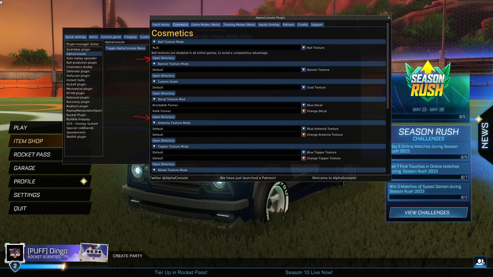

# Bakkesmod

Bakkesmod is a third party mod with a lot of fun features. We at RLIS use it in our production to make better content. You can use it to help with your training, or to locally host a match with your friends on a custom map. You can even change your decal on your car to be custom designed, but for that you need to also install the `BakkesMod` plugin `AlphaConsole`.

*As mentioned before it is a third party program not created by Psyonix/Epic. Install it at your own risk.*

## Alpha Console

`AlphaConsole` is a plugin that allows you to change some visuals in your game such as
 - Ball texture
 - Decal texture
 - Banner
 - more...

### **Installation instructions**:
To install alpha console you must first have `BakkesMod` installed on your computer. When `BakkesMod` has been you just visit https://bakkesplugins.com/plugins/view/108 and press 
```
Install with BakkesMod
```

### **Open Alpha Console plugin**:
When the plugin has been installed, open the bakkesmod program and open Rocket League. Inside Rocket League press `F2` to get the plugin on screen


Go to the `Plugins` Tab. Select the `AlphaConsole` in the toolbar to the left. `Toggle Alphaconsole Menu`


Now you are able to add custom decals to your cars. But the decals must be placed in a correct folder. Top open the folder location where the decals need to be simply press `open directory` under the `Decal Texture Mod` chapter.



Here you can simply copy the contents of our DecalTextures folder into the directory, and now you should be able to select the decal. The fun part is this will allow you to use custom decals in the Replay Manipulator plugin as well.

